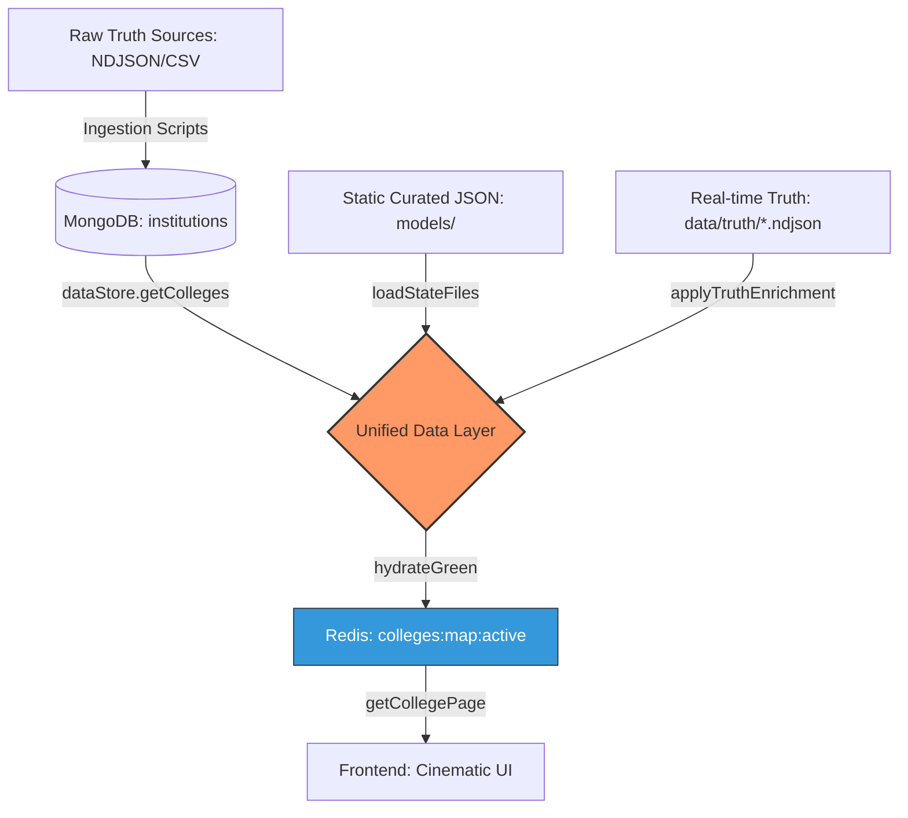

# CEI Full System: Technical Audit & Data Manifest
**Date**: 2026-04-21  
**Target Audience**: Technical Lead / Successor AI Agents  
**Project Context**: CEI (College Exam Intelligence) - System of Record (CMAT-PROBLEM)

---

## 0. Abstract for AI Successors (Handover Context)
> [!IMPORTANT]
> **System Architecture**: This is a Unified Data Layer ecosystem. The **System of Record (SSoT)** is MongoDB `cei_v2`, but the **Serving Layer** is a Redis-backed Blue-Green cache. 
> 
> Incoming data is resolved deterministically via the `collegeIdentityResolver` using normalized names and geographic corroboration. If you are task with data ingestion, ensure you prioritize the `stableKey` as the primary crosswalk anchor.

---

## 1. Unified Data Flow (SSoT Visualization)

The system operates on an hierarchical fallback and enrichment model:



---

## 2. Database Scenario (MongoDB `cei_v2`)

### 2.1 Collection Audit
| Collection | Record Count | Data Integrity |
| :--- | :--- | :--- |
| `institutions` | **13,096** | ⚠️ Raw AICTE format (BSON name: `institution_name`) |
| `engineering_cutoffs` | **86,064** | ✅ Rich normalized schema (JOSAA/CSAB/State) |
| `course_offerings` | **58,354** | ✅ High density; linked via `institute_name_raw` |
| `seat_matrix` | **2,698** | ✅ Granular (State/All-India quotas) |
| `medical_seat_matrix`| **779** | ⚠️ Targeted medical subset |
| `rankings` | **908** | ✅ NIRF/State verified sets |

### 2.2 Schema-vs-Reality Analysis
- **Model Expectation**: `CollegeSchema.js` expects fields `name`, `id`, and `isCore`.
- **Database Reality**: Most records use legacy AICTE fields: `institution_name`, `aicte_id`, `state_name`.
- **Runtime Correction**: `lib/collegeNormalizer.js` performs on-the-fly mapping:
  ```javascript
  const name = raw.institution_name || raw.name || "Unknown Institute";
  const isCore = raw.isCore || (id.startsWith('CORE-'));
  ```

---

## 3. Directory & Truth Asset Audit

### 3.1 Curated Local Models (`backend/models/`)
We have **2,139** state-curated institutions across 35+ JSON files. These represent the primary "Elite" and "State Core" colleges that receive premium UI ranking.
- **Top Sectors**: Tamil Nadu (274), Maharashtra (226), Karnataka (143), Uttar Pradesh (110).

### 3.2 High-Fidelity Truth Layer (`data/truth/`)
This directory contains direct truth injections that bypass standard catalog ingestion for speed and accuracy.

| Asset | Count (Lines) | Intelligence Value |
| :--- | :--- | :--- |
| `websites_truth.ndjson` | **46,499** | ✅ Primary source for verified URLs |
| `aicte_iceberg_truth.ndjson`| **22,379** | ✅ Historical structural integrity check |
| `courses_truth.ndjson` | **22,975** | ✅ Branch-level audit trail |
| `pan_india_bulk_2024.ndjson`| **1,802** | ✅ Unified 2024 metadata foundation |
| `gujarat_acpc_2025.ndjson` | **693** | ✅ Future-dated predictive intelligence |

---

## 4. Identity Resolution Architecture

Entity linking is handled by `backend/lib/collegeIdentityResolver.js`. 

- **Deterministic Matching**: Prioritizes `stableKey` and `aisheCode`.
- **Fuzzy Resolution**: Uses `strictNormalizeName()` (Lowercase + alphanumeric removal) and corroborates using `State` or `City`.
- **Collision Mitigation**: Generates a `data/truth/identity_collision_report.json` to flag ambiguous matches (e.g., colleges with identical names in different districts).

---

## 5. Strategic Recommendations for Future Agents

1. **DB Migration**: Permanent update of `institution_name` → `name` in MongoDB to remove the runtime overhead of `collegeNormalizer`.
2. **Core Synchronization**: Batch update `isCore: true` for the 2,139 local institutions to enable efficient database-level tier-1 filtering.
3. **Identity Deep-Linking**: Use the 46k records in `websites_truth.ndjson` to perform a bulk-bridge between AICTE raw data and AISHE truth records.

---
**Audit Manifest Finalized.**  
**Status: READY FOR HANDOVER / EXPANSION**
